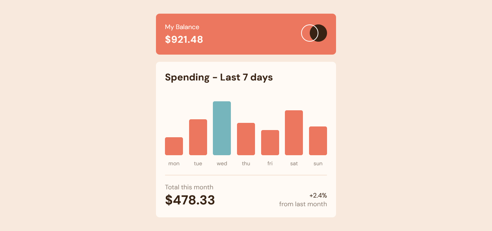
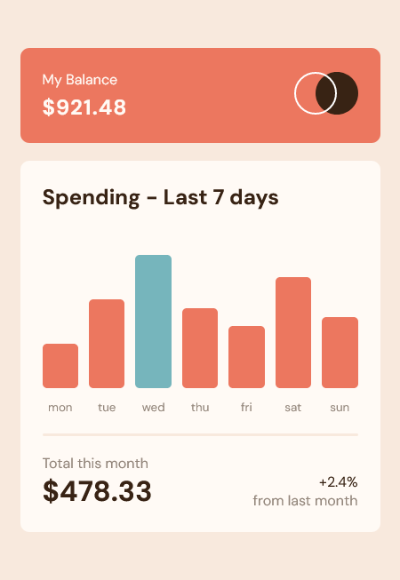

# Frontend Mentor - Expenses chart component solution

This is a solution to the [Expenses chart component challenge on Frontend Mentor] 

## Overview

This a mobile first approach simple page where the css skill is tested

### The challenge

Users will be able to:

- View the bar chart and hover over the individual bars to see the correct amounts for each day
- See the current day’s bar highlighted in a different colour to the other bars
- View the optimal layout for the content depending on their device’s screen size
- See hover states for all interactive elements on the page

### Screenshot

### Links

- Solution URL: [Github Expenses-chart](https://github.com/olanrewajuyusuf/Expenses-chart-component)
- Live Site URL: [Expenses Chart](https://wallewdev-expenses-chart.netlify.app/)

## My process

### Built with

- Semantic HTML5 markup
- CSS custom properties
- Flexbox

### Continued development

Have a long way to go...

## Author

- Frontend Mentor - [@olanrewajuyusuf](https://www.frontendmentor.io/profile/olanrewajuyusuf)
- Twitter - [@WaliyyullahY](https://www.twitter.com/WaliyyullahY)

## Acknowledgments

Thanks to frontend mentor for this opportunity.
